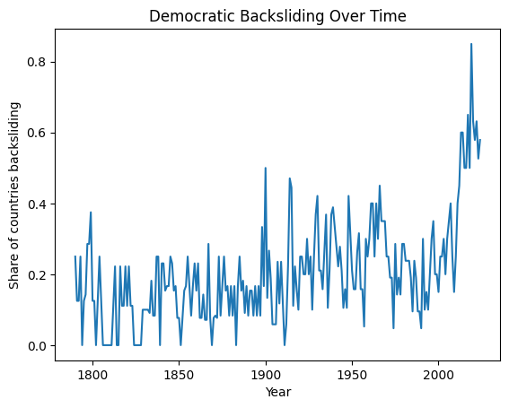

# Institutional Capture and Democratic Backsliding

Early-warning indicators of democratic backsliding using V-Dem data and institutional capture theory.

This repository contains a data science analysis of early-warning indicators of democratic backsliding, grounded in institutional capture theory and inspired by Anne Applebaum’s *Autocracy, Inc.*

## Motivation

Contemporary democratic decline rarely occurs through abrupt electoral collapse. Instead, erosion unfolds gradually as political and economic elites capture oversight institutions, manipulate rules, and narrow political competition while maintaining the outward appearance of elections.

Inspired by Anne Applebaum’s *Autocracy, Inc.* and the rise in democratic backsliding events over the past decade, this project examines which observable institutional indicators precede democratic decline across contemporary states. While direct cross-national measures of offshore finance and elite wealth flows are unavailable in panel form, institutional indicators can reveal the conditions under which elite-driven capture becomes politically consequential.

## Data

- **Primary Source:** Varieties of Democracy (V-Dem) Country–Year Dataset v15
- **Supplementary sources:** World Bank World Development Indicators (WDI), KAOPEN Index (Chinn–Ito)
- **Unit of analysis:** Country–year  
- **Sample:** 108 contemporary sovereign states (non-historical polities observed since 2000)  
- **Period:** Post-1990  

The analysis emphasizes indicators with full cross-national coverage to maximize comparability and avoid reliance on imputation.

## Outcome: Democratic Backsliding

Democratic backsliding is operationalized as a substantive year-to-year decline in electoral democracy. Specifically, a backsliding event occurs when a country’s V-Dem polyarchy index declines by at least 0.01 points from the previous year. This threshold excludes trivial measurement noise while capturing meaningful institutional erosion.



*Figure 0. The figure shows the share of countries experiencing democratic backsliding each year. Coverage increases substantially in the post-1990 period as more countries enter the dataset. The figure is descriptive and intended for contextual motivation only.*


## Methods

- Logistic regression models predicting backsliding events
- Institutional predictors lagged by one year to ensure temporal ordering
- Country-clustered standard errors
- Baseline models without fixed effects, followed by robustness checks with year fixed effects
- Data-first coverage diagnostics to identify a common-denominator set of indicators
- Construction of a composite **institutional capture index** aggregating corruption, clientelism, oversight interference, rule manipulation, political exclusion, and judicial constraints

## Key Findings

- Interference with legislatures and executive control over electoral rules consistently precede democratic backsliding.
- Political exclusion significantly increases the probability of subsequent democratic decline.
- Systemic corruption and weakened institutional constraints are associated with higher backsliding risk.
- The availability of alternative sources of information does not reliably prevent democratic erosion under conditions of institutional capture.
- A composite capture index significantly predicts backsliding in the subsequent year, supporting a gradual institutional erosion mechanism rather than abrupt regime breakdown.


### Political capture rises before democratic backsliding


*Figure 1. Political capture increases steadily in the years preceding the first democratic backsliding event (t = 0), indicating that institutional capture is a leading condition rather than a contemporaneous feature of democratic decline.*

### Backsliding risk increases with institutional capture


*Figure 2. Higher levels of institutional capture are associated with a substantially higher predicted probability of democratic backsliding in the subsequent year.*

### Capital mobility conditions democratic backsliding risk


*Figure 3. The increase in democratic backsliding risk associated with institutional capture is larger in countries with lower capital mobility, consistent with arguments about elite exit options and insulation from accountability.*


## Interpretation

The results support a view of democratic backsliding as a downstream consequence of institutional capture. Rather than sudden failures of mass participation or elections, democratic erosion appears to follow sustained weakening of oversight institutions, exclusion of political actors, and rule manipulation that protects rent-seeking coalitions.

## Theory Alignment: Institutional Capture

This project is informed by the institutional capture framework articulated in Anne Applebaum’s *Autocracy, Inc.*, which emphasizes elite-driven mechanisms such as corruption, rule manipulation, weakened oversight, and financial opacity. Because some core mechanisms highlighted in the theory (e.g., offshore finance and transnational wealth flows) are not directly observable in cross-national panel data, the empirical analysis focuses on institutional indicators that plausibly enable and reflect capture.

A mapping of Applebaum-aligned primary and secondary indicators to observable V-Dem measures is provided in `docs/applebaum_indicators.md`, with the indicators used in the main analysis clearly marked.


## Repository Structure
```
├── notebooks/        # Data preparation, diagnostics, and models
├── data/             # Data access instructions (raw data not included)
├── docs/             # Figures and supplementary materials
├── paper_draft.md    # Draft paper text
├── requirements.txt  # Python dependencies
```


## Data Availability

Due to licensing restrictions, raw V-Dem data are not redistributed in this repository. Users can obtain the data directly from the V-Dem project and place it in the appropriate local directory as described in `data/README.md`.

## Status

Core diagnostics and baseline models are complete. Ongoing work focuses on robustness checks, data triangulation, and extended analyses.

## Disclaimer

This analysis identifies institutional conditions consistent with elite-driven capture but does not directly measure offshore finance, informal elite networks, or wealth flows emphasized in qualitative accounts of contemporary autocracy.


## Visual reflection: regime trajectories and reversibility

The animation below illustrates changes in regime status over time using alternative polyarchy thresholds. Even under conservative classification, a small number of countries move from solid democracy to autocracy and back again within a few decades. This highlights the non-linear and reversible nature of democratic trajectories and motivates a focus on early-warning indicators rather than regime endpoints.


Additional robustness checks, descriptive analyses, and alternative specifications are available in the notebook files and in `docs/figures/`.
