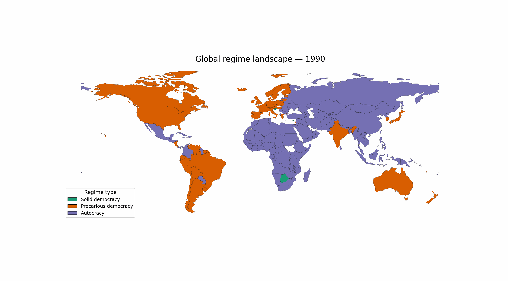

# Institutional Capture and Democratic Backsliding

Early-warning indicators of democratic backsliding using V-Dem data and institutional capture theory.

This repository contains a data science analysis of early-warning indicators of democratic backsliding, grounded in institutional capture theory and inspired by Anne Applebaum’s *Autocracy, Inc.*

## Motivation

Contemporary democratic decline rarely occurs through abrupt electoral collapse. Instead, erosion unfolds gradually as political and economic elites capture oversight institutions, manipulate rules, and narrow political competition while maintaining the outward appearance of elections.

Inspired by Anne Applebaum’s *Autocracy, Inc.* and the rise in democratic backsliding events over the past decade, this project examines which observable institutional indicators precede democratic decline across contemporary states. While direct cross-national measures of offshore finance and elite wealth flows are unavailable in panel form, institutional indicators can reveal the conditions under which elite-driven capture becomes politically consequential.

## Data

- **Primary Source:** Varieties of Democracy (V-Dem) Country–Year Dataset v15
- **Supplementary sources:** World Bank World Development Indicators (WDI), KAOPEN Index (Chinn–Ito)
- **Unit of analysis:** Country–year  
- **Sample:** 108 contemporary sovereign states (non-historical polities observed since 2000)  
- **Period:** Post-1990  

The analysis emphasizes indicators with full cross-national coverage to maximize comparability and avoid reliance on imputation.

## Outcome: Democratic Backsliding

Democratic backsliding is operationalized as a substantive year-to-year decline in electoral democracy. Specifically, a backsliding event occurs when a country’s V-Dem polyarchy index declines by at least 0.01 points from the previous year. This threshold excludes trivial measurement noise while capturing meaningful institutional erosion.


*Figure 0. The figure shows the share of countries experiencing democratic backsliding each year. Coverage increases substantially in the post-1990 period as more countries enter the dataset. The figure is descriptive and intended for contextual motivation only.* [Figure notes](docs/figures/Democratic_backsliding_over_time.md)


## Methods

- Logistic regression models predicting backsliding events
- Institutional predictors lagged by one year to ensure temporal ordering
- Country-clustered standard errors
- Baseline models without fixed effects, followed by robustness checks with year fixed effects
- Data-first coverage diagnostics to identify a common-denominator set of indicators
- Construction of a composite **institutional capture index** aggregating corruption, clientelism, oversight interference, rule manipulation, political exclusion, and judicial constraints

## Key Findings

- Indicators of institutional capture increase steadily in the years preceding the first observed democratic backsliding event, indicating that institutional weakening tends to occur *before* measurable declines in electoral democracy rather than as a reaction to them (Figure 1).

- Higher overall levels of institutional capture are associated with a substantially greater predicted probability of democratic backsliding in the subsequent year, suggesting that capture provides a meaningful early-warning signal of democratic erosion (Figure 2).

- The relationship between institutional capture and democratic backsliding is conditioned by economic context: the increase in backsliding risk associated with capture is larger in countries with lower capital mobility, meaning that institutional capture is more likely to translate into democratic decline where economic elites have fewer opportunities to move assets abroad (Figure 3).


### Political capture rises before democratic backsliding


**Figure 1. Institutional capture increases in advance of the first observed democratic backsliding event (t = 0). This pattern indicates that democratic erosion is typically preceded by a period of institutional weakening, supporting the interpretation of capture as an early-warning signal rather than something that emerges only once decline is already underway.* [Figure notes](docs/figures/Political_capture_and_democratic_backsliding.md)


### Backsliding risk increases with institutional capture


**Figure 2. Predicted probabilities show that higher levels of institutional capture are associated with a substantially increased likelihood of democratic backsliding in the following year. This result highlights the practical relevance of capture measures for assessing near-term democratic risk.* [Figure notes](docs/figures/Predicted_backsliding_risk_by_institutional_capture.md)

### Capital mobility conditions democratic backsliding risk


*Figure 3. The association between institutional capture and democratic backsliding varies by capital mobility. Capture is more strongly linked to backsliding in countries with lower capital mobility, meaning that institutional weakening is more likely to be followed by democratic decline where elites have fewer opportunities to move financial resources abroad.* [Figure notes](docs/figures/Political_capture_and_capital_mobility.md)


## Interpretation

The results support a view of democratic backsliding as a downstream consequence of institutional capture. Rather than sudden failures of mass participation or elections, democratic erosion appears to follow sustained weakening of oversight institutions, exclusion of political actors, and rule manipulation that protects rent-seeking coalitions.

## Theory Alignment: Institutional Capture

This project is informed by the institutional capture framework articulated in Anne Applebaum’s *Autocracy, Inc.*, which emphasizes elite-driven mechanisms such as corruption, rule manipulation, weakened oversight, and financial opacity. Because some core mechanisms highlighted in the theory (e.g., offshore finance and transnational wealth flows) are not directly observable in cross-national panel data, the empirical analysis focuses on institutional indicators that plausibly enable and reflect capture.

A mapping of Applebaum-aligned primary and secondary indicators to observable V-Dem measures is provided in `docs/applebaum_indicators.md`, with the indicators used in the main analysis clearly marked.


## Repository Structure
```
├── notebooks/        # Data preparation, diagnostics, and models
├── data/             # Data access instructions (raw data not included)
├── docs/             # Figures and supplementary materials
├── paper_draft.md    # Draft paper text
├── requirements.txt  # Python dependencies
```


## Data Availability

Due to licensing restrictions, raw V-Dem data are not redistributed in this repository. Users can obtain the data directly from the V-Dem project and place it in the appropriate local directory as described in `data/README.md`.

## Status

Core diagnostics and baseline models are complete. Ongoing work focuses on robustness checks, data triangulation, and extended analyses.

## Disclaimer

This analysis identifies institutional conditions consistent with elite-driven capture but does not directly measure offshore finance, informal elite networks, or wealth flows emphasized in qualitative accounts of contemporary autocracy.


## Visual reflection: regime trajectories and reversibility

The animation below illustrates changes in regime status over time using alternative polyarchy thresholds. Even under conservative classification, a small number of countries move from solid democracy to autocracy and back again within a few decades. This highlights the non-linear and reversible nature of democratic trajectories and motivates a focus on early-warning indicators rather than regime endpoints.



## Key Concepts

- **Democratic backsliding**  
  A gradual decline in democratic quality over time, typically involving erosion of checks and balances, political rights, or electoral integrity rather than sudden regime collapse.

- **Institutional capture**  
  A process in which political or economic elites gain sustained influence over oversight institutions (such as courts, legislatures, or electoral authorities), allowing them to manipulate rules and limit accountability while maintaining formal democratic procedures.

- **Polyarchy index (V-Dem)**  
  A composite measure of electoral democracy capturing the extent to which political leaders are selected through free and fair elections with broad participation, political competition, and associated civil liberties.

- **Clientelism**  
  The exchange of political support for targeted material benefits, often undermining programmatic policy-making and institutional accountability.

- **Capital mobility (KAOPEN Index)**  
  The degree to which financial capital can move freely across national borders, commonly used as a proxy for elite exit options and financial openness.

- **Country–year data**  
  A panel data structure in which each observation represents one country in one specific year, enabling longitudinal analysis over time.

- **Panel data**  
  Data that track multiple units (such as countries) across multiple time periods, allowing researchers to analyse change over time.

- **Lagged predictors**  
  Explanatory variables measured in a prior time period (e.g. one year earlier) to ensure that institutional conditions precede observed outcomes.

  
Additional robustness checks, diagnostic analyses, and alternative model specifications are documented in the notebook files and in `docs/figures/`. These materials provide further detail on variable selection, model sensitivity, and exploratory results that are not included in the main README in order to maintain a clear focus on the core findings.


